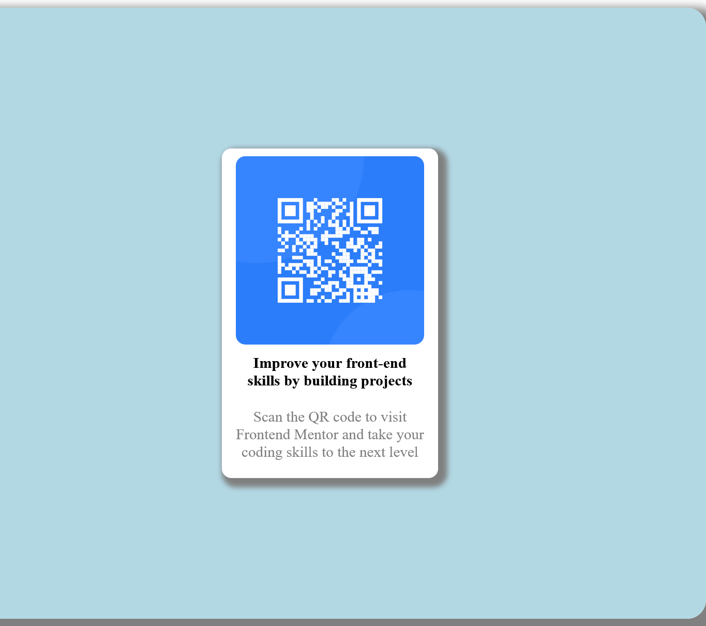

# Frontend Mentor - QR code component solution

This is a solution to the [QR code component challenge on Frontend Mentor](https://www.frontendmentor.io/challenges/qr-code-component-iux_sIO_H). Frontend Mentor challenges help you improve your coding skills by building realistic projects. 

- [Overview]
(#overview)
>>>>>>>This was my first challenge on front-end mentor.The best thing about these projects are before you star them you think you know all but as you progress through the project you know that knowledge only increases and you never know where you can get stuck.
 
  - [Screenshot]
  
  >>>>Check out my project screenshot and compare how it matches to the original challenge screenshot

  - [Links]
  - Solution URL: 
[https://www.frontendmentor.io/challenges/qr-code-component-iux_sIO_H]

- Live Site URL: 
[https://github.com/hamidhaier23]

- [Process]
(#my-process)
The process involved in completing this challenge only took the precise use of #flexbox tag.

  - [Builtwith]
    (#built-with)
    i used html and css to complete this challenge.
    I used basics of the followings:
- Semantic HTML5 markup
- CSS custom properties
- Flexbox
- Flexwrap

  - [Whatilearned]
    (#what-i-learned)
    I learned a better use of flexbox to give designs to our UI.

    Below are my favourite and most used elements throughout this challenge and i have provide a clip of the codings i would ponder upon if i looked back to this challenge.

To see how you can add code snippets, see below:

```html
<h1>div</h1>
"div" is my most used block element and i love this.
```

```css
.flex {
  color: white;gray;lightblue
}
```
I just loved the flex styling property and the respective colors mentioned above

```js
no javascript use{
  -----no javascript used-----
}
```

  - [Continued development](#continued-development)
  I really want to continue emphasizing on CSS, JS and React.

  - [Usefulresources]
  (#useful-resources)
This project did not involve reading any article or taking help with tags through the internet.
I just gave myself time and did this as it is presented to you. 

- [Author]
(#author)
Hamid Mohammad
- Website - [Hamid Mohammad](https://github.com/hamidhaier23)
- Frontend Mentor - [@hamidhiader23](https://www.frontendmentor.io/profile/hamidhaier23)
- Twitter - [@yourusername](https://www.twitter.com/yourusername)
'
- [Acknowledgments]
(#acknowledgments)
I really want to thank GOD for what he has given to me and pray to HIM that he joins me with the righteous and forgive me and all of us who seek HIS forgiveness.
Aameen.
